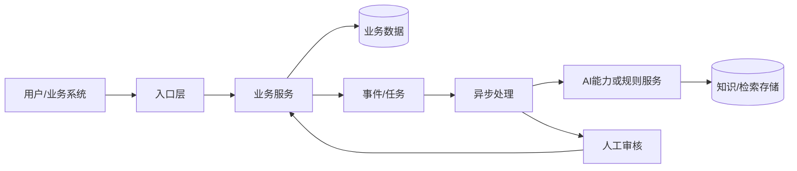
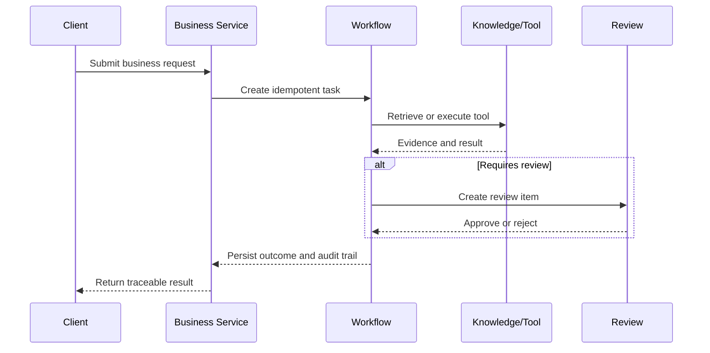

# Architecture And Evidence

## 图示要求

根据实际项目替换节点，不要直接复制示例：





## 证据等级

| 状态 | 含义 | 可用于面试结论 |
|---|---|---|
| `observed` | 从现有代码、配置或运行行为观察到 | 可以描述现状 |
| `implemented` | 已完成代码或配置改动 | 可以描述实现，不等于效果 |
| `verified` | 有可重复命令、测试或实验结果 | 可以描述结果和指标 |
| `planned` | 设计完成但未实施 | 只能描述方案和下一步 |
| `simulation` | 用本地替身或缩小规模模拟 | 必须说明模拟边界 |

## 最小证据记录

```markdown
### EV-XXX: 证据标题
- 状态: observed | implemented | verified | planned | simulation
- 结论:
- 来源: `path/to/file:line` / command / dashboard / experiment
- 前置条件:
- 复现或验证步骤:
- 结果:
- 限制与后续:
```

每个面试亮点至少关联一条 `verified` 或清楚标记为 `planned` 的证据。对 AI 系统补充样本集版本、评估方法、提示版本、模型版本、成本和权限过滤结果。
